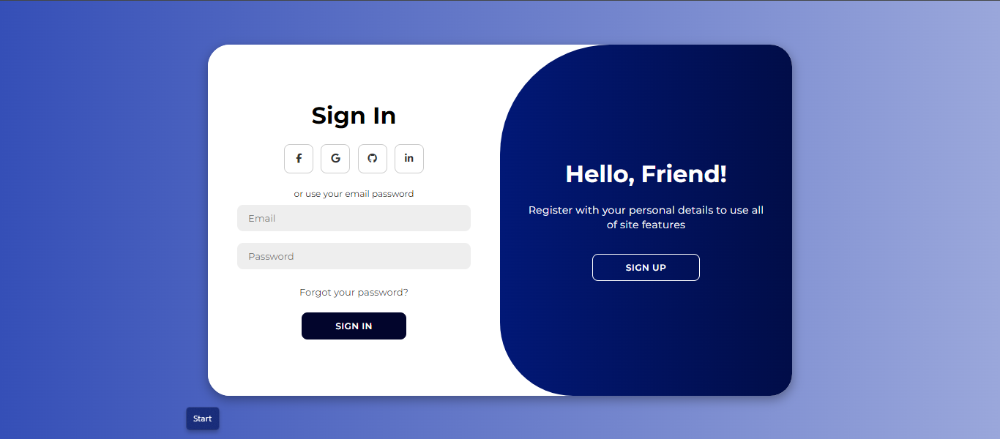
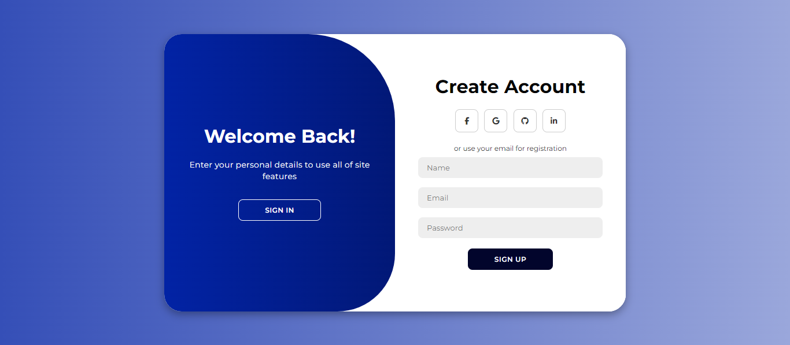

# Animated Login and Signup Page

This project contains files for creating an animated login and signup page using HTML, CSS, and JavaScript. The page provides a visually appealing interface for users to sign in or register for an account.

## Files Included

1. `index.html`: This file contains the HTML structure for the login and signup page.
2. `styles.css`: This file contains the CSS styles for styling the login and signup page, including animations and transitions.
3. `script.js`: This file contains the JavaScript code for handling user interactions and animations on the login and signup page.

## To preview

You can view the hosted webpage [here](https://animated-login-signup-page-hazel.vercel.app/).

## How to Use

To use the animated login and signup page:

1. Clone the repository:

```bash
git clone https://github.com/NushaMBZ/Animated-Login-Signup-Page.git
```

2. Navigate into the project directory:
```bash
cd Animated-Login-Signup-Page
```
3. Open the `index.html` file in a web browser.

## Screenshot
Here we have project screenshot :

<div align="center">
    
    
</div>

## Features

- Visually appealing animations and transitions for a better user experience.
- Simple and intuitive layout for easy navigation.
- Responsive design to ensure compatibility with various screen sizes and devices.

## License

This project is licensed under the MIT License - see the [LICENSE](LICENSE) file for details.
